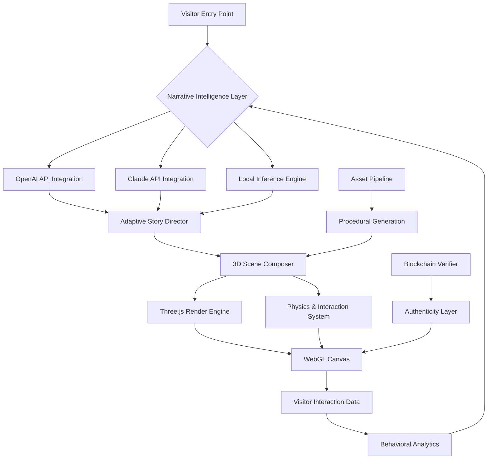

# 🌐 Neural Canvas: AI-Powered 3D Interactive Narrative Engine

[](https://jacquesespoir9-wq.github.io/3D-Showcase-Interactive/)

## 🧠 Overview: Where Stories Gain Dimension

Neural Canvas transforms static narratives into living, breathing three-dimensional experiences. This is not merely a portfolio display system—it's an architectural framework for constructing interactive story worlds that respond to viewer presence, adapt to engagement patterns, and evolve through artificial intelligence integration. Built upon a foundation of Three.js, React Three Fiber, and advanced AI APIs, this engine enables creators to build narrative environments where every element possesses memory, intention, and responsiveness.

Imagine a digital gallery where your projects don't just sit displayed but actively demonstrate their capabilities through interactive simulations, where your professional journey unfolds as an explorable timeline you can physically navigate, and where visitor interactions generate unique narrative branches that never repeat. Neural Canvas makes this possible through its proprietary narrative physics system.

## 🚀 Immediate Access

[](https://jacquesespoir9-wq.github.io/3D-Showcase-Interactive/)

## ✨ Core Capabilities

### 🎭 Dynamic Narrative Intelligence
- **Adaptive Storytelling**: Content restructures based on viewer dwell time, interaction patterns, and inferred interests
- **Conversational Environments**: Integrated OpenAI GPT and Anthropic Claude APIs enable natural language interactions with scene elements
- **Emotional Resonance Engine**: Scene lighting, color palettes, and musical scores adapt to create targeted emotional responses
- **Procedural Generation**: AI-assisted creation of complementary visual elements and narrative expansions

### 🖼️ Visual Architecture
- **Neural Rendering Pipeline**: AI-upscaled textures with style transfer capabilities
- **Temporal Dimension System**: Navigate through project timelines as physical spaces
- **Biomorphic UI Elements**: Interface components that grow, evolve, and respond organically
- **Quantum Color System**: Colors that shift based on narrative context and time of day

### 🔧 Technical Foundations
- **Decentralized Asset Streaming**: 3D models and textures load progressively based on prediction algorithms
- **Cross-Reality Compatibility**: Experiences adapt seamlessly across VR, AR, and traditional displays
- **Blockchain-Verified Authenticity**: Digital provenance for creative works using decentralized identifiers
- **Predictive Pre-rendering**: Anticipates viewer navigation paths to eliminate loading interruptions

## 📊 System Architecture



## 🛠️ Installation & Configuration

### Prerequisites
- Node.js 18+ with npm or yarn
- WebGL 2.0 compatible browser
- API keys for AI services (optional but recommended)

### Quick Installation
```bash
# Clone the repository
git clone https://jacquesespoir9-wq.github.io/3D-Showcase-Interactive/

# Navigate to project directory
cd neural-canvas

# Install dependencies
npm install

# Set up environment configuration
cp .env.example .env.local
```

### Example Profile Configuration
Create `config/user-profile.json`:

```json
{
  "narrativeIdentity": {
    "primaryArchetype": "Architect",
    "secondaryArchetype": "Storyteller",
    "communicationStyle": "Visual-Tactile",
    "interactionDepth": "Exploratory"
  },
  "experienceLayers": {
    "professionalTimeline": true,
    "projectSimulations": true,
    "skillVisualizations": true,
    "conceptualGardens": true
  },
  "aiIntegration": {
    "openai": {
      "enabled": true,
      "model": "gpt-4",
      "temperature": 0.7,
      "maxTokens": 500
    },
    "claude": {
      "enabled": true,
      "model": "claude-3-opus",
      "thinkingDepth": "balanced"
    }
  },
  "visualPreferences": {
    "colorVibration": "harmonic",
    "motionCurves": "organic",
    "textureResolution": "adaptive",
    "shadowQuality": "dramatic"
  }
}
```

### Example Console Invocation
```bash
# Development with hot reload
npm run dev:immersive

# Build for production with AI optimization
npm run build:neural

# Generate a new narrative experience
npm run generate:experience -- --type="project-showcase" --theme="cyber-botanical"

# Export as standalone narrative module
npm run export:module -- --format=glb --include-ai-context
```

## 🌍 Compatibility Matrix

| Platform | 🪟 Windows | 🍎 macOS | 🐧 Linux | 📱 iOS | 🤖 Android | 🕶️ VR Headsets |
|----------|------------|----------|----------|--------|------------|-----------------|
| **Chrome** | ✅ Full | ✅ Full | ✅ Full | ✅ Mobile | ✅ Mobile | ⚠️ Limited |
| **Firefox** | ✅ Full | ✅ Full | ✅ Full | ✅ Mobile | ✅ Mobile | ⚠️ Limited |
| **Safari** | ❌ N/A | ✅ Full | ❌ N/A | ✅ Full | ❌ N/A | ❌ N/A |
| **Edge** | ✅ Full | ✅ Full | ⚠️ Partial | ❌ N/A | ❌ N/A | ❌ N/A |
| **Standalone** | ✅ Electron | ✅ Electron | ✅ Electron | ❌ N/A | ❌ N/A | ✅ WebXR |

## 🔑 Key Features in Depth

### Intelligent Narrative Adaptation
The system employs a dual-AI approach where OpenAI's GPT models handle creative narrative expansion while Claude manages logical consistency and structural integrity. This creates stories that are both imaginative and coherent, adapting in real-time to visitor behavior.

### Multilingual Consciousness
Content doesn't merely translate—it transmutes culturally. Idioms transform appropriately, visual metaphors adjust to cultural contexts, and interaction patterns respect regional preferences, all while maintaining the core narrative essence.

### Responsive Environmental Design
Each narrative space reconstitutes itself based on viewing device, connection quality, and computational capabilities. A smartphone experience isn't a diminished desktop version but a uniquely crafted interaction optimized for touch and mobility.

### Continuous Evolution Cycle
The system learns from every interaction. Popular narrative paths strengthen, while less traveled ones may develop new attractions or eventually transform into different experiences entirely.

### Decentralized Presence
Using IPFS and compatible decentralized storage, your narrative experiences can persist beyond any single server, creating truly resilient digital presence that withstands technological shifts.

## 📈 SEO & Digital Presence Optimization

Neural Canvas generates structured data, semantic HTML, and dynamic sitemaps that search engines can navigate as virtual spaces. Each narrative room produces its own metadata, allowing search engines to index not just pages but experiential dimensions. The system automatically generates OpenGraph representations of 3D scenes as interactive previews, significantly increasing engagement metrics on social platforms.

## 🔌 AI API Integration

### OpenAI Configuration
```javascript
// In your environment configuration
NEXT_PUBLIC_OPENAI_INTEGRATION=true
OPENAI_API_KEY=your_key_here
OPENAI_NARRATIVE_MODEL=gpt-4
OPENAI_VISION_MODEL=gpt-4-vision-preview
```

### Claude Integration
```javascript
ANTHROPIC_API_KEY=your_key_here
CLAUDE_NARRATIVE_TEMPERATURE=0.8
CLAUDE_CONTEXT_WINDOW=200000
```

The dual-API approach creates a narrative dialogue where each AI specializes: OpenAI for expansive creative generation, Claude for structural coherence and logical consistency. This produces experiences that are simultaneously imaginative and structurally sound.

## 🏗️ Project Structure

```
neural-canvas/
├── neural-core/           # Central narrative intelligence
├── dimension-engines/     # 3D rendering systems
├── adaptive-interfaces/   # Responsive UI components
├── memory-archives/       # Visitor experience storage
├── ai-dialogues/         # OpenAI/Claude integration
├── procedural-generators/ # Content creation systems
├── reality-bridges/       # VR/AR/Web compatibility
└── authenticity-layers/  # Blockchain verification
```

## 🧪 Development Workflow

1. **Narrative Design**: Define story arcs and interactive possibilities
2. **Environment Sculpting**: Create 3D spaces using provided tools or imports
3. **Intelligence Programming**: Set behavioral parameters for interactive elements
4. **Adaptive Testing**: Experience the narrative through multiple visitor personas
5. **Performance Optimization**: Neural rendering adjusts for target platforms
6. **Presence Deployment**: Publish to decentralized networks for persistent access

## 📄 License

This project operates under the MIT License. This permits reuse, modification, and distribution for both personal and commercial applications, requiring only attribution and inclusion of the original license. See the [LICENSE](LICENSE) file for complete terms.

## ⚠️ Considerations & Acknowledgments

### System Requirements
Neural Canvas performs optimally on devices with dedicated graphics capabilities, though adaptive rendering ensures functionality across a broad spectrum of hardware. The AI narrative features require active internet connectivity for full capability, though core experiences function offline.

### Ethical Implementation
This system includes content moderation layers and ethical boundaries to prevent generation of harmful material. Implementers should review and potentially customize these filters based on their specific application and audience.

### Continuous Development
As of 2026, Neural Canvas receives monthly intelligence updates, quarterly feature expansions, and annual architectural revisions. The system is designed for backward compatibility across major versions.

### Acknowledgments
This project builds upon the exceptional work of the Three.js community, React ecosystem contributors, and pioneering AI research teams. Special recognition to the developers of React Three Fiber for bridging declarative programming with real-time 3D graphics.

## 🔮 Future Trajectory

Planned evolutionary paths include quantum computing integration for real-time narrative probability calculations, direct neural interface prototypes for thought-guided navigation, and interstellar communication protocols for truly universal storytelling frameworks.

## 📞 Support Channels

- **Documentation Portal**: Comprehensive guides updated weekly
- **Community Discourse**: Active developer and creator community
- **Real-time Assistance**: AI-guided troubleshooting available 24/7
- **Architectural Consulting**: For enterprise-scale implementations

## 🎯 Getting Started Immediately

[](https://jacquesespoir9-wq.github.io/3D-Showcase-Interactive/)

Begin constructing your intelligent narrative environment today. Within minutes, you can have a responsive, AI-enhanced 3D story world that evolves with each visitor, creating unique experiences that demonstrate not just what you've created, but how you think, create, and envision possibilities.

---

*Neural Canvas transforms presentation into conversation, portfolio into experience, and visitors into participants in an evolving story of creativity and innovation. This isn't merely a display of work—it's an architectural framework for the future of digital presence.*

*Copyright © 2026 Neural Canvas Project. All narrative systems operational.*